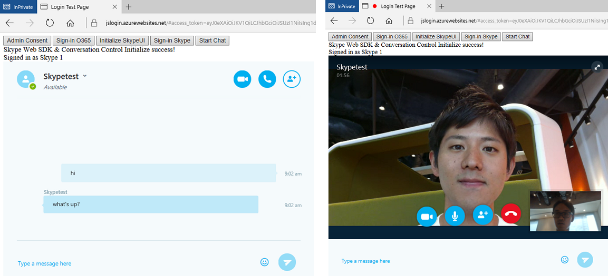
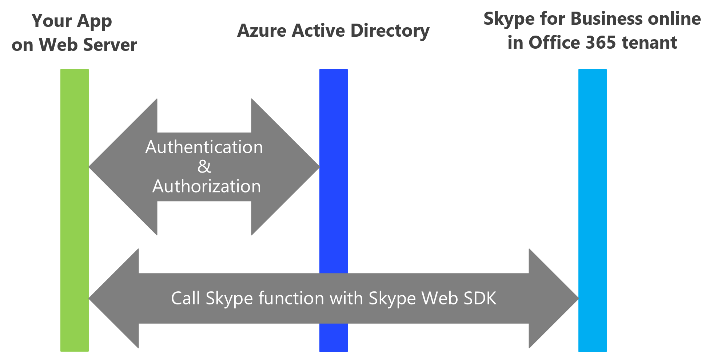
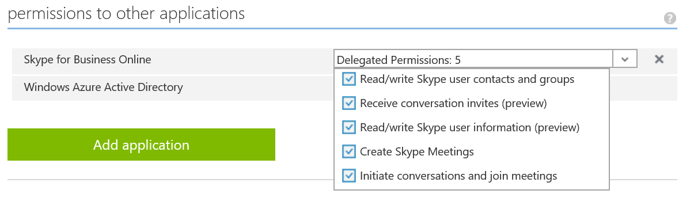
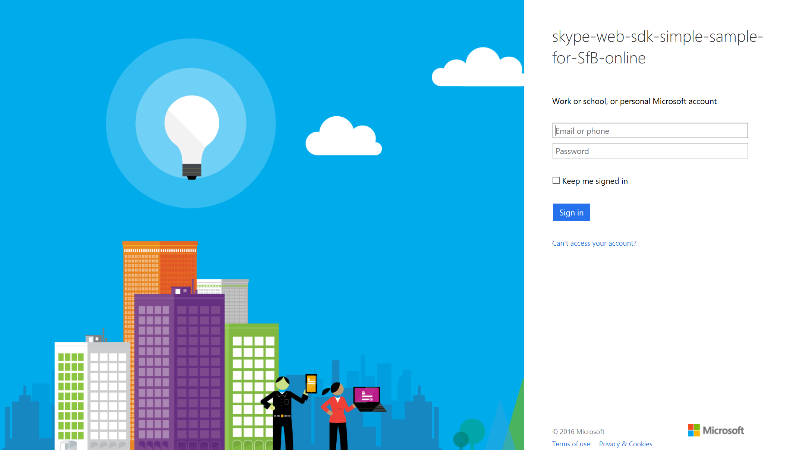
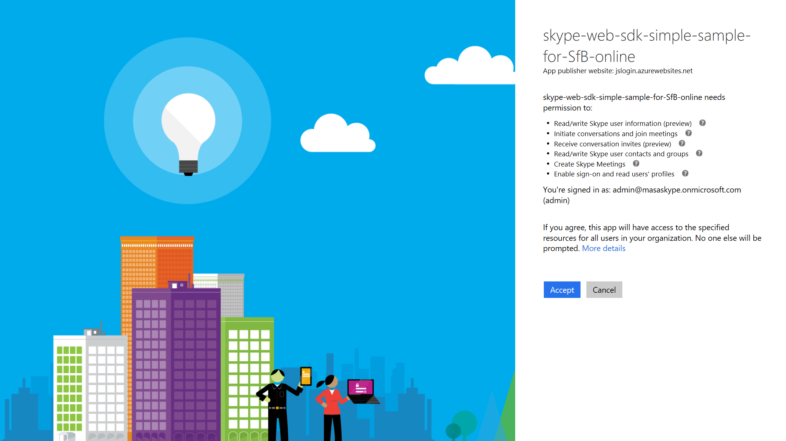

# skype web sdk simple sample for SfB online
This document is made for developers who want to start Skype Web SDK development!
After you read it and try tutorials, you can sign-in, chat, audio/video communication with Skype Web SDK in the browser like the image below.

## Abstract
* What is Skype Web SDK?
* Preparering for development
* How to deploy and try sample in your environment
* Next Step

# What is Skype Web SDK?
Skype Web SDK is one of the Key SDK of [Skype Developer Platform](https://dev.office.com/Skype).
It is a set of JavaScript Web APIs and HTML controls that enable you to build web experiences that seamlessly integrate a wide variety of real-time collaboration models leveraging [Skype for Business](https://www.skype.com/en/business/skype-for-business/) services and the larger Skype network. 

* [See some Senarios](http://dev.office.com/skype/explore)
* [Try interactive demo](https://ucwa.skype.com/websdk)
* [Learn more](https://msdn.microsoft.com/skype/websdk/SkypeWebSDK)

# Preparering for development
For developing application with Skype Web SDK, you need to prepare these resources below.
1. Office 365 tenant. It inclues Skype for Business.
2. Azure Active Directory
3. Web Server
4. Any editor for coding javascript and html.

The combination flow of these resources is below.

## 1.Office 365 tenant
Skype for Business environment is included in Office 365(O365) tenant, so you need to prepare O365 tenant.
**Please refer [this document](https://msdn.microsoft.com/en-us/office/office365/howto/setup-development-environment#get-an-office-365-account-to-access-office-365-apis) to setup your O365 tenant. After you get O365 tenant please [add some test users](https://support.office.com/en-us/article/Add-users-individually-to-Office-365-Admin-Help-1970f7d6-03b5-442f-b385-5880b9c256ec?ui=en-US&rs=en-US&ad=US) for testing.**

### For your information
Microsoft offers "Office 365 Dev Program" to get free O365 tenant. You can get a free O365 tenant from [here](http://dev.office.com/devprogram) and get a free Office 365 tenant, but it includes only one user subscription, so it is difficult for Skype testing.

## 2.Azure Active Directory
Skype Web SDK use OAuth for authentication and authorization, and it is handled by Azure Active Directory (Azure AD).
If you are new for Azure, **you can sign-up free trial account from this [site](https://azure.microsoft.com/en-us/free/)**.

## 3.Web Server
Because Skype Web SDK is for web application, you need web server to host the app.
If you need new Web Server, it is nice choice to try [Azure Web Apps](https://azure.microsoft.com/en-us/services/app-service/web/).

## 4.Any editor for coding javascript and html
You can choose any editor or IDEs to develop with Skype Web SDK. If you want to get new one, let's try Visual Studio code!
**Please download and install it from [the web site](https://code.visualstudio.com)**.

# How to deploy and try sample in your environment
The Office 365 services use Azure Active Directory (Azure AD) to provide secure authentication to users' Office 365 data.
To access the Skype for Business, you need to register your app with Azure AD.

1. Associate your O365 account with Azure AD
2. Register your app in Azure Active Directory to use Skype for Business.
3. Update config.js
4. Deploy to your web server
5. Allow to access for Skype for Business by tenant Administrator.
6. Try it

## 1. Associate your O365 account with Azure AD
Before register your app with Azure AD, you need to associate your O365 account with Azure AD.
**Please read [this document](https://msdn.microsoft.com/en-us/office/office365/howto/setup-development-environment#associate-your-office-365-account-with-azure-ad-to-create-and-manage-apps) and set up it.**

## 2. Register your app in Azure Active Directory to use Skype for Business.
Let's register your app in Azure AD and set permission to access Skype for Business.
**Please read and follow "Registering your application in Azure AD" and "Configure your app for OAuth implicit grant flow" in [this site](https://msdn.microsoft.com/en-us/skype/websdk/developwebsdkappsforsfbonline#app-registration).**
In the Azure AD, you should set REPLY URL.Please set "https://sample.com" if you have sample.com domain.

### For your information
You can also refer [this document](https://msdn.microsoft.com/en-us/office/office365/howto/add-common-consent-manually#register-your-brower-based-web-app-with-the-azure-management-portal).It includes some screen cliping, so you can easily understand how to register your app.

You set only one permission in the document above, but in the test purpose you can set all permission like this image.

## 3. Update config.js
When you register your app in Azure AD, you set or got the value of properties below.
* Name
* CLIENT ID
* REPLY URL

Please copy the each value and paste them in config.js.

## 4. Deploy to your web server
Just put the sample codes in the root of your web server.
If you use Azure Web App, you can select [some method](https://azure.microsoft.com/en-us/documentation/articles/web-sites-deploy/) to deploy.
Such as using [Git](https://azure.microsoft.com/en-us/documentation/articles/app-service-deploy-local-git/) and [FTP](https://azure.microsoft.com/en-us/documentation/articles/web-sites-deploy/#ftp).

## 5. Allow to access for Skype for Business by tenant Administrator.
Azure AD offer **Consent Flow** for authentication and authorization. These are the images of consent flow.

1. Login with Azure AD

2. Consent will be shown for grant

Azure AD offer two type of conset.
* User Consent : Each users can see consent and grant by themselves.
* Administrator Consent : Only Administrator can see conset and grant by him/her. It is somtime used for registering ISV's Application.

Skype Web SDK uses Administrator Consent. You should access Administrator consent flow as O365 tenant Administrator and accept permissions. This sample code has [Admin Consent]button, so **Please click [Admin Consne]button.** 

* If you want to know "Consent Flow" more, please read [this article](https://azure.microsoft.com/en-us/documentation/articles/active-directory-integrating-applications/#overview-of-the-consent-framework).
* [This document](https://msdn.microsoft.com/en-us/skype/websdk/developwebsdkappsforsfbonline#tenant-administrator-consent-flow) describe the code for Skype Web SDK Administrator consent.

## 6. Try it
I recommend to prepare 2 PCs having audio/video device and 2 O365 user accounts for testing.**Please follow steps below in each PC.**

1. Access your web App.
2. (If it is first time) Click [Admin Consent]button to grant your app.
3. Click [Sign-in O365]button to sign-in with your O365 account.
4. Click [Initialize SkypeUI]button to Initialize Skype Web SDK.
5. Click [Sign-in Skype]button to sign-in Skype.
6. Click [Start Chat]button to show Chat/Audio/Video window using [Conversation Control](https://msdn.microsoft.com/skype/websdk/useconversationcontrol). 
7. Let's chat, call with your another PC. When you call to other user, the brower will show the dialog to trun on your mic/camera. Please check and turn on.

### For your information: 
* You may need installing plugin for enable audio/video ([learn more](https://msdn.microsoft.com/en-us/skype/websdk/gettingstarted#skype-for-business-web-app-plug-in-ortc-support)).
* You can check supported browsers and capabilities in [here](https://msdn.microsoft.com/skype/websdk/apiproductkeys).
* I recommend to test with [Microsoft Edge](https://www.microsoft.com/en-us/windows/microsoft-edge). It can use full capabilities of Skype Web SDK now.

In order to understand how to develop, please read the codes and comments in the sample.
**Enjoy** your development with Skype Web SDK!

# Next Step
* To learn how to develop with Skype Web SDK, you can refer more rich sample in [GitHub](https://github.com/OfficeDev/skype-web-sdk-samples).
* If you are mobile developer, you can develop with [Skype for Businee App SDK](https://msdn.microsoft.com/en-us/skype/appsdk/skypeappsdk).
* If you want to know SDK deeply, you can refer [this document](https://ucwa.skype.com/reference/WebSDK/modules/_s4b_sdk_d_.jcafe.html).

# Contributing
You will need to sign a [Contributor License Agreement](https://cla.microsoft.com/) before submitting your pull request. To complete the Contributor License Agreement (CLA), you will need to submit a request via the form and then electronically sign the Contributor License Agreement when you receive the email containing the link to the document. This needs to only be done once for any Microsoft  OSS project.

You can check general contributing way in [CONTRIBUTIONG.md](./CONTRIBUTING.md).

# Copyright
Copyright (c) 2016 Microsoft Corporation. All rights reserved.